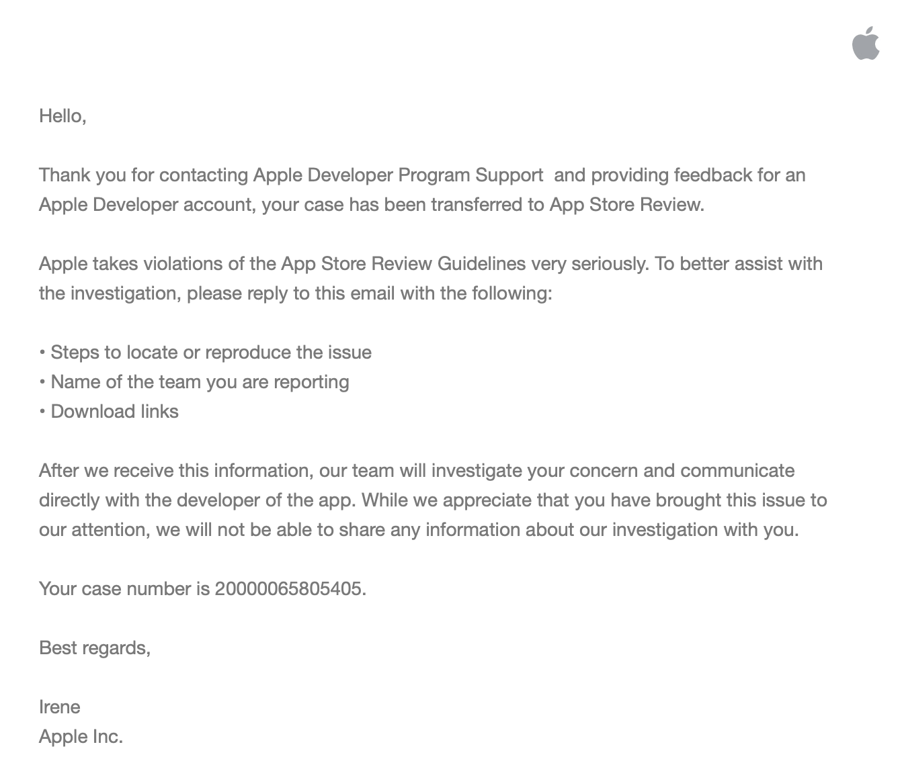
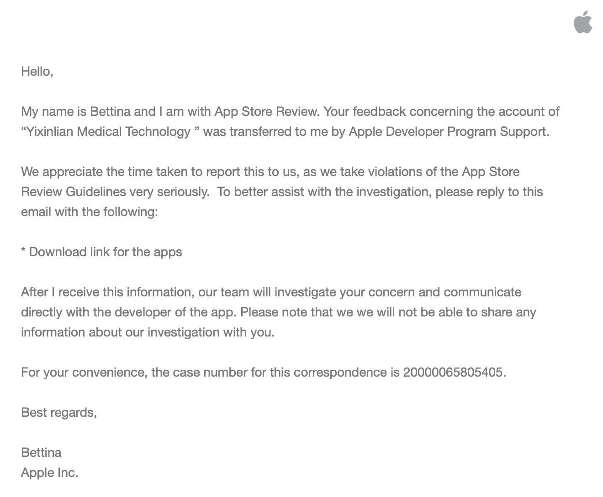

# Reports

## Online App Generator

### DCloud

> Thanks for sharing the clues, and related colleagues have been arranged to check and confirm.
> 
> In addition, we would like to ask, how do you obtain these application information? Welcome to share more clues, fight crime, and build harmony together.

### APICloud

No feedback

## Push Service

### JPush

> Dear Jiguang users:
>
> Hello, you can directly report to the police: Follow the latest instructions of the Nanshan Internet Police Brigade: 1. Any public security agency in a different place that is not in Shenzhen should contact Police Officer Xiong. After Police Officer Xiong reviewing the materials sent to us, the materials can be transferred to the police officer who came to investigate.

### Getui

> Hello!
>
> Thank you very much for your attention to our company and your complaints about such fraudulent apps. We will deal with it in a timely manner after verification.
>
> For your related communication needs, you can directly communicate with Li, the member of our technical support department. Thank you!

### Xiaomi

> Hello,
>
> Thank you for your attention and support to Xiaomi Security. We have contacted relevant colleagues to follow up on the feedback, and will synchronize with you in time if there is any progress.

### Huawei

> Hello:
>
> We have fed the information you provided to the relevant products, and will inform you as soon as possible when there is progress.
>
> Sincerely
>
> Huawei PSIRT

### Meizu

No feedback

## Money Mule Based Payment

### Idlefish

> Thanks for your report
> 
> The report information you provide is very important, we will focus on the user.

## App Certificate

### Apple

